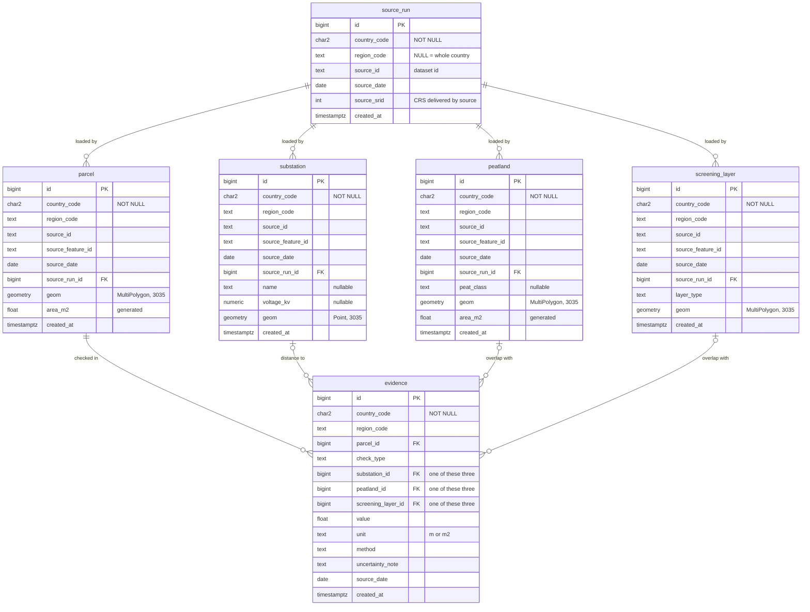
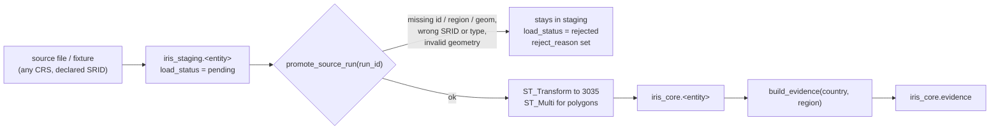

# Schema diagram

Core tables (`iris_core`). Every arrow is a composite foreign key that includes
`country_code`, so a row can only reference rows from its own country.

Keys, written out:

| Table | Primary key | Country-scoped unique keys | Foreign keys |
|---|---|---|---|
| source_run | id | (country_code, id), (country_code, source_id, source_date) | - |
| parcel, substation, peatland, screening_layer | id | (country_code, id), (country_code, source_id, source_feature_id) | (country_code, source_run_id) -> source_run |
| evidence | id | (country_code, parcel_id, check_type, substation_id, peatland_id, screening_layer_id) NULLS NOT DISTINCT | (country_code, parcel_id), (country_code, substation_id), (country_code, peatland_id), (country_code, screening_layer_id) |

## Staging and promotion flow

Staging tables mirror the core names (`iris_staging.parcel`, `.substation`,
`.peatland`, `.screening_layer`). They have an untyped `geom`, nullable attributes,
`load_status` and `reject_reason`. `source_run` lives in `iris_core` and is shared
by both schemas.
